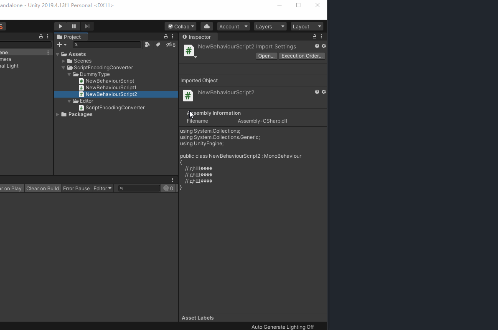

# Script Encoding Converter

> Important: Don't Use it before backup your scripts (usally backup by git)

> 重要提示：请在使用前使用 git 提交你的代码

 Editor extension for covert script encoding from gb2312 to utf8，it's useful.
 
 这是一个将脚本编码从 GB2312 转换为 UTF8 的编辑器扩展，从某种角度来看，还挺好用！ 
 
 # Feature / 功能 
 1. 支持 Project 窗口单/多选文件、文件夹选中进行编码转换

    Muilt-files or folder can selected for onekey encoding convert 
  
 3. 支持设置为自动编码转换
 
    Can auto fix encoding issue if you prefer to.
 
 5. 有效的 UTF8 断言
 
    A simple but effective way to check wether a script is Encoding.utf8 or not.
 
 # GIF / 动画
 
 **Tips:**
 * 演示了单文件、多文件 UTF8 - GB2312 互相转换 

    Demonstrated the single file multi - file UTF8 - GB2312 conversion
  
 * 演示了脚本被修改后自动修改 编码为 UTF8 
 
    Demonstrates that the script is automatically changed to UTF8 after being modified
 
# Summary / 结语
 这个组件对脚本中有汉字的人会有帮助，它解决了某些情况下脚本编码会变成 GB2312 导致 Unity 识别异常的问题，异常表现为要么 Inspector 上可见乱码，要么 log 信息中出现乱码。
 
 This plugin would be helpful when script contians some Chinese characters. It solves the problem that in some cases the script will become a GB2312 Encoding and cause Unity  recognize abnormality. The details of the abnormality can be seen on the Inspector,as well as in the log context.

> 脚本使用的 UTF8 编码不管有没有 Bom 均可使用本工具。
>
> utf-8 dom and utf-8 can use this tool.
